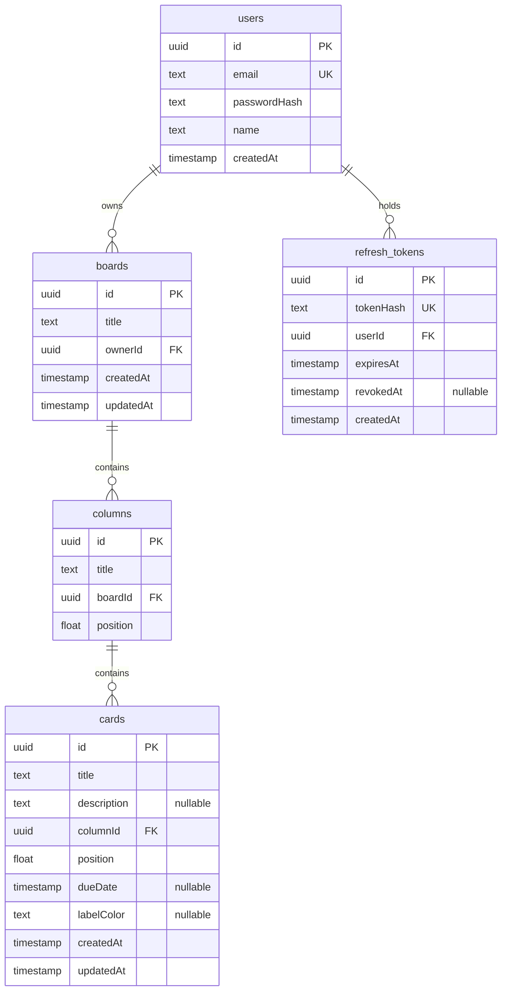

# Kanban Board

[](https://github.com/dias088/kanban-board/actions/workflows/ci.yml)

A Trello-style kanban board: boards, columns and cards with drag and drop, built as a
TypeScript monorepo with a React client and an Express + Prisma API.

The interesting parts are not the CRUD. They are the ordering model that survives two
people dragging into the same gap, and the refresh-token rotation that survives a page
full of parallel requests. Both are described under [Design decisions](#design-decisions).

**Live demo:** _(to be filled in)_

<!--
  Screenshot / GIF goes here. Suggested shot: the board in dark theme with three
  columns, mid-drag, so the drag overlay and the drop placeholder are both visible.

  
-->

_Screenshot coming soon._

---

## Try it without signing up

The login screen has a **Try the demo** button. It creates a private throwaway account with
a ready-made board, so nothing you do there affects anybody else.

Running locally, `npm run db:seed` also creates a fixed account:

| Email             | Password   |
| ----------------- | ---------- |
| `demo@kanban.dev` | `demo1234` |

---

## Stack

| Area    | Choice                                                                             |
| ------- | ---------------------------------------------------------------------------------- |
| Client  | React 18, TypeScript, Vite, React Router, TanStack Query, Tailwind CSS, @dnd-kit   |
| Forms   | react-hook-form + zod                                                              |
| API     | Node.js, Express, TypeScript, Prisma, PostgreSQL, zod, bcrypt, jsonwebtoken        |
| Testing | Vitest + Supertest (API, against a real PostgreSQL), Vitest + Testing Library (UI) |
| Tooling | npm workspaces, ESLint, Prettier, GitHub Actions                                   |

## Features

- Email and password accounts with access tokens, rotating refresh tokens and replay detection
- Boards, columns and cards: create, rename, delete, with cascading deletes
- Drag and drop cards inside a column, between columns, and reorder the columns themselves
- Full keyboard support for dragging, with announcements written for screen readers
- Optimistic updates that roll the board back and raise a toast when the server disagrees
- Card dialog with description, due date and a colour label; overdue dates are highlighted
- Light and dark themes following the OS preference, with a manual override
- Columns scroll sideways on a phone instead of being squeezed

---

## Run it locally

You need Node.js 20+ and either Docker or a local PostgreSQL.

```bash
git clone https://github.com/dias088/kanban-board.git
cd kanban-board
npm install
cp server/.env.example server/.env && cp client/.env.example client/.env
docker compose up -d && npm run db:migrate && npm run db:seed
npm run dev
```

The client is on <http://localhost:5173> and the API on <http://localhost:4000>.

**No Docker?** Create the role and databases in your existing PostgreSQL once, then skip
`docker compose up`:

```bash
psql -U postgres -h 127.0.0.1 -f scripts/init-local-db.sql
```

It creates the `kanban` role and the `kanban_dev` / `kanban_test` databases with the same
credentials docker-compose uses, so the `DATABASE_URL` from `.env.example` works either way.

### Scripts

| Command              | What it does                                    |
| -------------------- | ----------------------------------------------- |
| `npm run dev`        | shared schemas, API and client together         |
| `npm test`           | API tests against PostgreSQL, then client tests |
| `npm run lint`       | ESLint and a Prettier format check              |
| `npm run typecheck`  | `tsc --noEmit` across all three workspaces      |
| `npm run build`      | production build of every workspace             |
| `npm run db:migrate` | apply migrations to the development database    |
| `npm run db:seed`    | create the demo account and its sample board    |
| `npm run db:reset`   | drop, re-migrate and re-seed                    |
| `npm run db:studio`  | open Prisma Studio                              |

---

## Database schema



Deleting a user removes their boards, deleting a board removes its columns, deleting a
column removes its cards — all through `ON DELETE CASCADE` rather than application code.
Indexes cover every foreign key plus `(boardId, position)` and `(columnId, position)`,
which are the orderings every read uses.

---

## API

Everything lives under `/api`. Request bodies are validated with zod schemas that the
client imports from the same package, so the rules cannot drift apart.

### Auth

| Method | Path                 | Notes                                                       |
| ------ | -------------------- | ----------------------------------------------------------- |
| POST   | `/api/auth/register` | 201, sets the refresh cookie                                |
| POST   | `/api/auth/login`    | same answer for a wrong password and an unknown email       |
| POST   | `/api/auth/demo`     | 201, throwaway account with a sample board                  |
| POST   | `/api/auth/refresh`  | rotates the token; replaying a spent one kills all sessions |
| POST   | `/api/auth/logout`   | 204, revokes the presented token                            |
| GET    | `/api/auth/me`       | current user                                                |

Credential routes are rate limited to 20 requests per 15 minutes per IP.

### Boards, columns, cards

| Method | Path                           | Notes                                           |
| ------ | ------------------------------ | ----------------------------------------------- |
| GET    | `/api/boards`                  | list with column and card counts                |
| POST   | `/api/boards`                  | 201                                             |
| GET    | `/api/boards/:id`              | board with its columns and cards, in order      |
| PATCH  | `/api/boards/:id`              | rename                                          |
| DELETE | `/api/boards/:id`              | 204, cascades                                   |
| POST   | `/api/boards/:boardId/columns` | 201                                             |
| PATCH  | `/api/columns/:id`             | rename only — a position cannot be written here |
| PATCH  | `/api/columns/:id/move`        | `{ afterId?, beforeId? }`                       |
| DELETE | `/api/columns/:id`             | 204, cascades                                   |
| POST   | `/api/columns/:columnId/cards` | 201                                             |
| PATCH  | `/api/cards/:id`               | absent key keeps the value, `null` clears it    |
| PATCH  | `/api/cards/:id/move`          | `{ columnId, afterId?, beforeId? }`             |
| DELETE | `/api/cards/:id`               | 204                                             |

### Errors

Every failure has the same shape:

```json
{
  "error": {
    "code": "VALIDATION_ERROR",
    "message": "Request validation failed",
    "details": { "title": ["Title is required"] }
  }
}
```

Codes: `VALIDATION_ERROR`, `UNAUTHORIZED`, `NOT_FOUND`, `CONFLICT`, `PAYLOAD_TOO_LARGE`,
`TOO_MANY_REQUESTS`, `INTERNAL_ERROR`.

---

## Design decisions

### Ordering is fractional, and ties are broken by id

A card's place is a `float`. Dropping it between two neighbours gives it their midpoint, so
a move is one row update instead of renumbering the column. When a gap gets too small to
split — about thirty drops into the exact same spot — the column is renumbered inside the
same transaction.

Two clients working from the same view can still derive the _same_ midpoint, and no
isolation level prevents that: their transactions read the same two rows and write
different ones, so there is no conflict to detect. Equal positions therefore have to be
survivable rather than impossible, which is why every read orders by `(position, id)`. The
id tie-break is what makes the order total and repeatable.

`SERIALIZABLE` still earns its place for the renumbering path, where one transaction
rewrites rows another has read. To let PostgreSQL see that, a move reads the whole target
column rather than fetching its two neighbours by id. Aborted transactions are replayed by
a retry wrapper, so a write conflict surfaces as a successful retry or an honest `409`,
never a `500`.

### The client never sends a position

`PATCH /api/cards/:id/move` takes `afterId` and `beforeId` — the neighbours of the drop —
and the server computes the number. Column reordering works the same way, which is why
`PATCH /api/columns/:id` only accepts a title. A client that could write a raw ordering
value could also corrupt the ordering.

### Refresh tokens are opaque, hashed and rotated

Access tokens are 15-minute JWTs in the `Authorization` header. Refresh tokens are 48 bytes
of randomness in an httpOnly cookie scoped to `/api/auth`; only their SHA-256 hash reaches
the database. A JWT would have been self-contained and therefore impossible to revoke,
which is the one thing this token needs to be.

Every refresh rotates. Presenting a token that was already rotated means the cookie leaked,
so that revokes every live session of the user. On the client a single shared promise
guarantees one refresh at a time — without it, a page firing several requests would send
several refreshes, rotation would invalidate all but the first, and the user would be
signed out mid-session.

### A foreign resource answers 404

Not 403: a 403 confirms the id exists. There is a test asserting that the response for
someone else's board is byte-for-byte identical to the response for a board that was never
created. Ownership is a relation filter inside the same query, so it costs no extra round trip.

### The access token never touches localStorage

It lives in a module variable. On reload the session is restored from the httpOnly refresh
cookie, which script injected into the page cannot read.

### The client and the API share one origin

The browser talks to `/api` on its own origin — proxied by Vite in development, rewritten by
`vercel.json` in production. A client on Vercel calling an API on Render directly would make
the refresh cookie a third-party cookie, and Safari has blocked those by default since 13.1
regardless of `SameSite=None`. On iOS that is every browser.

### Dragging has its own handle

The drag listeners sit on a handle rather than on the card. dnd-kit's keyboard sensor starts
a drag on Enter and Space, which are exactly the keys that have to open the card instead.
Separating them also gives each role an honest label: "Reorder card X" and "Open card X".

---

## Testing

```bash
npm test
```

API tests run against a real PostgreSQL rather than a mocked Prisma client, because the
things worth testing here — cascades, ordering, transaction behaviour — only exist in the
database. Tables are truncated between cases and the suite applies migrations to
`TEST_DATABASE_URL` before it starts.

Worth a look:

- `server/src/tests/auth.test.ts` — replaying a rotated token kills every session
- `server/src/tests/cards.test.ts` — renumbering, concurrent moves, neighbours from the wrong column
- `server/src/tests/boards.test.ts` — a foreign board is indistinguishable from a missing one
- `client/src/tests/api.test.ts` — parallel 401s trigger exactly one refresh
- `client/src/tests/board-state.test.ts` — the drag rearrangement logic as pure functions

A note on the output: `prisma:error transaction failed to commit` lines during the card
tests are expected. They are PostgreSQL aborting a deliberately concurrent move, which the
retry wrapper then replays.

---

## Deployment

Three free tiers: **Neon** for PostgreSQL, **Render** for the API, **Vercel** for the client.

### 1. Database — Neon

Create a project and copy the pooled connection string. Keep `?sslmode=require`.

### 2. API — Render

New Web Service from this repository.

| Setting            | Value                                                                            |
| ------------------ | -------------------------------------------------------------------------------- |
| Root directory     | repository root                                                                  |
| Build command      | `npm ci && npm run build --workspace shared && npm run build --workspace server` |
| Start command      | `npm run start --workspace server`                                               |
| Pre-deploy command | `npm run db:migrate:deploy --workspace server`                                   |

Migrations belong in the pre-deploy command, not the start command: a failed migration then
blocks the release instead of crash-looping the service.

Environment variables:

```
NODE_ENV=production
DATABASE_URL=<the Neon connection string>
JWT_SECRET=<node -e "console.log(require('crypto').randomBytes(48).toString('hex'))">
CLIENT_URL=https://<your-app>.vercel.app
COOKIE_SAMESITE=lax
TRUST_PROXY=true
```

`TRUST_PROXY=true` is required: Render terminates TLS at its proxy, and without it Express
will not mark the cookie `Secure`.

A `server/Dockerfile` is included if you would rather deploy a container. Build it from the
repository root: `docker build -f server/Dockerfile -t kanban-api .`

### 3. Client — Vercel

Import the repository; `vercel.json` already carries the build settings. Edit the first
rewrite and replace the destination with your Render URL:

```json
{ "source": "/api/:path*", "destination": "https://your-api.onrender.com/api/:path*" }
```

That rewrite is what keeps the client and the API on one origin, so `COOKIE_SAMESITE` stays
`lax`. If you point the browser straight at the Render URL instead, you need
`COOKIE_SAMESITE=none` over HTTPS — and Safari will still refuse to store the cookie.

### Cold starts

Render's free tier spins a service down after 15 minutes of inactivity and takes 30 to 60
seconds to wake up. The client shows a message saying so rather than an endless spinner.

---

## Troubleshooting

**`EPERM: operation not permitted, rename ... query_engine-windows.dll.node` on Windows.**
`npm run dev` is running and Node is holding the Prisma engine open, so `prisma generate`
cannot replace it. Stop the dev server before `npm run build`.

**`P1000: Authentication failed against database server`.** The `kanban` role does not exist
yet. Run `docker compose up -d`, or `psql -U postgres -f scripts/init-local-db.sql` if you
are using a local PostgreSQL.

**Port 5432 already in use.** A local PostgreSQL has it. Either use that one via
`scripts/init-local-db.sql`, or change the mapping in `docker-compose.yml` to `5433:5432`
and update `DATABASE_URL`.

**`TEST_DATABASE_URL is not set`.** `server/.env` is missing. Copy it from
`server/.env.example`.

---

## License

MIT
